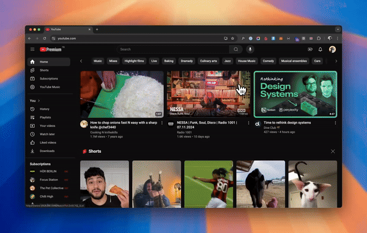

# SocialBlade Quick Access Chrome Extension

This Chrome extension opens the SocialBlade profile of the currently active YouTube channel. It supports regular videos, Shorts, and channel pages.

## Features
- Automatically fetches and opens the SocialBlade profile of the YouTube channel.
- Works with regular videos, Shorts, and channel pages.

## Installation
1. Clone this repository or download it as a ZIP.
2. Open `chrome://extensions/` in your Chrome browser.
3. Enable **Developer Mode**.
4. Click **Load unpacked** and select the project folder.

## Usage
1. Navigate to a YouTube video, Shorts, or channel.
2. Click the extension icon to open the channel's SocialBlade profile.

## Demo

## Contributing
Contributions are welcome! Feel free to submit a pull request.

## License
[MIT](LICENSE)
